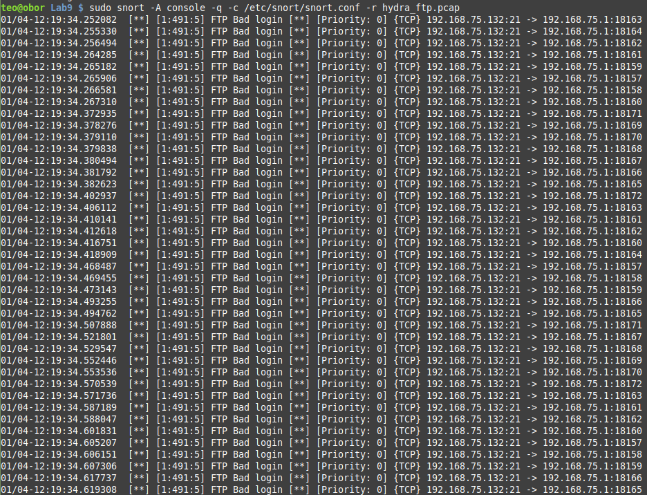

# Hydra FTP PCAP
The results of running `snort` are dispalyed in the image below:



The connection was initialted from outside the LAN (supposing `192.168.75.1` is the gateway).
There seems to be some sort of attack going on as all responses come in very quick succession.
For this reason, we can assume that the requests came in a batch as well.
Perhaps it was an attempt to bruteforce the password of some of the ftp users.

From looking at the `.pcap` file itself in wireshark, we can see this is likely to be the case, because some common users such as `test`, `test`, `fred`, `none`, `anon` and `admin` were tried by the attacker. 


# Heartbleed Attack Detection
Following the advice from [here](https://asecuritysite.com/encryption/heart3), the rule for detecting a Heartbleed attack should looke like this:
```
alert tcp any any -> any any (msg:"Heartbleed Attack!"; content:"|18 03 02 00|"; content:"|16 03 02 00|"; sid:492; rev:5;)
```
